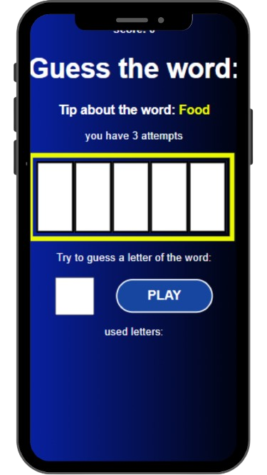
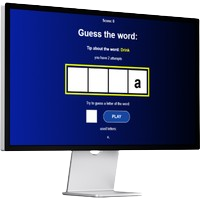

# GUESS THE WORDS


This is a word guessing game, inspired by the classic letter-by-letter mechanic. The player must try to guess the secret word by selecting letters from the alphabet. Each correct guess reveals the letter in its proper position, while incorrect guesses count as failed attempts. The challenge is to complete the word before running out of tries!

## About

This project was developed to practice React and explore the use of React Hooks for state and component logic management.

-Built with React + Hooks (useState, useEffect, useRef)
-Clean and responsive interface
-Letter-by-letter guessing mechanic


## Result  ✨



<details>
<summary> <h2>Versão Desktop</h2></summary>



</details>


## Made with 🔨

- HTML
- CSS
- JAVASCRIPT
- REACT


## Running locally

### Prerequisites

- Node.js (v16 or later)
- npm (v8 or later)

### Step by Step

1. Clone this repository:

```bash
git clone https://github.com/erick-amorim377/Guess-the-words.git
```


2.  Install the dependencies:


```bash
npm install
```


3.  Start the development server:


```bash
npm run dev
```

Open your browser and visit `http://localhost:3000` ✨✨

## Use

1.  **start the game:** Click on the "START PLAYING" button to start the game
2.  **view the hint and the number of attempts:** After entering the game screen, it is important to know the hint and the number of attempts.
3.  **choose a letter:** based on the hint think of a letter and put it in the field and press "PLAY" to find out if that letter is part of the secret word.
4.  **cumulative score:** accumulate the maximum number of points, knowing that you earn 100 points for each correct word.


---

#### Author 👷


[Erick Amorim](https://www.linkedin.com/in/erick-amorim-365326265)